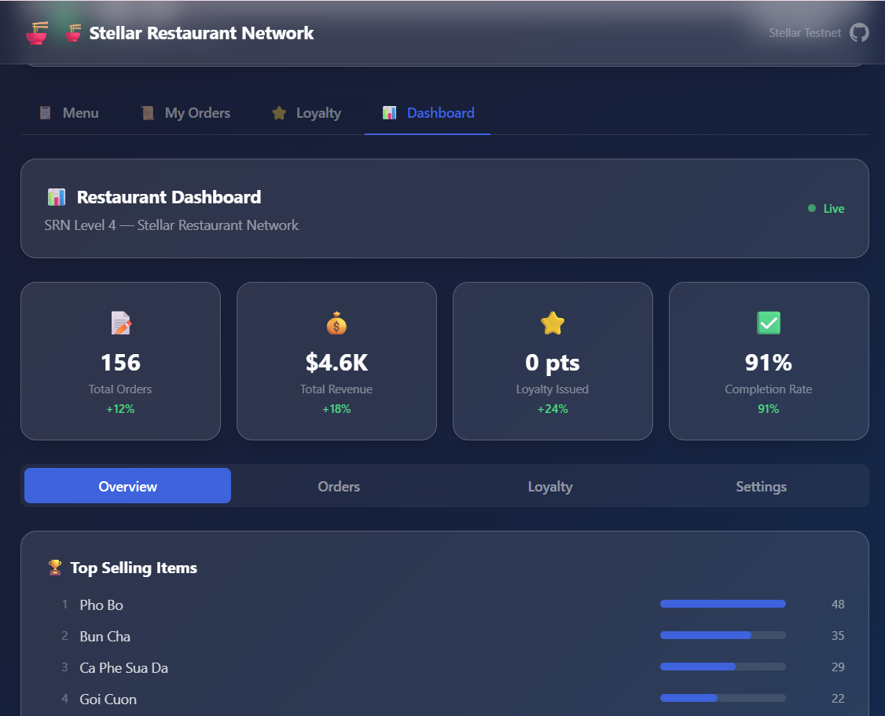
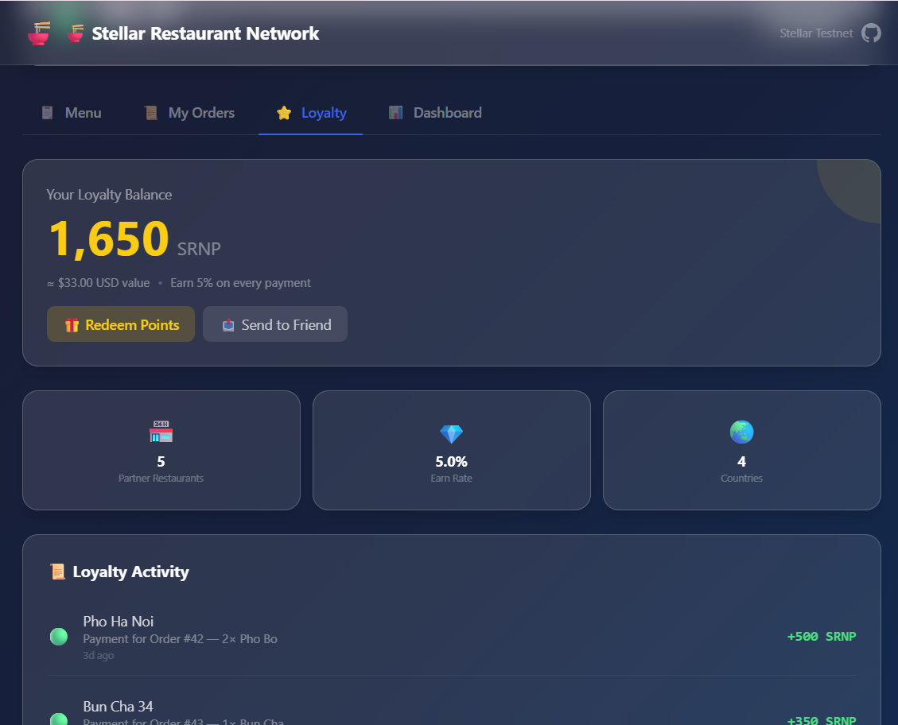
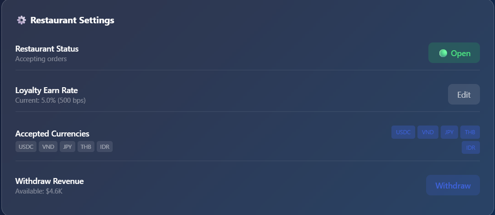

# 🍜 Stellar Restaurant Network (SRN) — Level 4 Green Belt

**Cross-Border Food Commerce + Tokenized Loyalty on Stellar Soroban**

Small restaurants in Southeast Asia lose 3-5% per transaction to credit card processors, have zero access to international customers, and run fragmented loyalty programs. **SRN solves all three** by building on Stellar's unique stack:

- **Soroban smart contracts** for restaurant operations (extending the Level 3 contract at `CCVH3EH...TMQAY`)
- **Stellar Anchors (SEP-24/31)** for fiat on/off ramps — a restaurant in Hanoi receives VND while a tourist in Tokyo pays in JPY via stablecoin
- **Stellar's built-in DEX** for automatic FX conversion at near-zero cost
- **SEP-41 fungible tokens** for portable loyalty points that work across the entire restaurant network

---

## 📋 Table of Contents

- [Architecture](#-architecture)
- [Smart Contracts](#-smart-contracts)
- [Key Features](#-key-features)
- [Tech Stack](#-tech-stack)
- [Project Structure](#-project-structure)
- [Getting Started](#-getting-started)
- [Deployment](#-deployment)
- [Demo](#-demo)
- [User Feedback](#-user-feedback)
- [Analytics & Monitoring](#-analytics--monitoring)
- [Submission Checklist](#-submission-checklist)

---

## 🏗️ Architecture

```
┌──────────────────────────────────────────────────────────────────────┐
│                    Stellar Restaurant Network (SRN)                    │
├──────────────────────────────────────────────────────────────────────┤
│                                                                       │
│  ┌─────────────────────┐  ┌──────────────────────┐                   │
│  │   Customer App       │  │  Restaurant Dashboard │                  │
│  │  (React + TS)        │  │  (React + TS)         │                  │
│  ├──────────────────────┤  ├───────────────────────┤                  │
│  │ • Browse menus       │  │ • Order management    │                  │
│  │ • Place orders       │  │ • Revenue analytics   │                  │
│  │ • Multi‑currency pay │  │ • Loyalty program     │                  │
│  │ • Loyalty points     │  │ • Cross‑border stats  │                  │
│  │ • Cross‑border flow  │  │ • Menu management     │                  │
│  │ • Order history      │  │ • Withdraw funds      │                  │
│  └─────────┬────────────┘  └───────────┬───────────┘                  │
│            │                            │                              │
│  ┌─────────┴────────────────────────────┴───────────┐                │
│  │                   SRN Backend                      │                │
│  ├────────────────────────────────────────────────────┤                │
│  │ • Anchor Integration (SEP‑24/SEP‑31)               │                │
│  │ • DEX Path Finding                                 │                │
│  │ • Exchange Rate Oracle                             │                │
│  │ • Event Indexer                                    │                │
│  │ • Analytics API                                    │                │
│  └─────────┬──────────────────────────────────────────┘               │
│            │                                                           │
│  ┌─────────┴──────────────────────────────────────────┐               │
│  │                Stellar Soroban (Testnet)             │               │
│  ├──────────────────────────────────────────────────────┤               │
│  │  ┌──────────────────┐  ┌────────────────────────┐   │               │
│  │  │ Restaurant        │  │ LoyaltyToken (SEP-41) │   │               │
│  │  │ Contract          │  │ • Mint on payment     │   │               │
│  │  │ • Menu + Orders   │  │ • Burn on redeem      │   │               │
│  │  │ • Multi-currency  │  │ • Transferable       │   │               │
│  │  │ • Loyalty hooks   │  │ • Cross-restaurant   │   │               │
│  │  │ • Analytics events│  │ • Earn rate config   │   │               │
│  │  └──────────────────┘  └────────────────────────┘   │               │
│  │                                                       │               │
│  │  ┌──────────────────────────────────────────────┐     │               │
│  │  │ RestaurantRegistry                            │     │               │
│  │  │ • Onboarding & verification                   │     │               │
│  │  │ • Anchor channel configs                      │     │               │
│  │  │ • Currency pair registry                      │     │               │
│  │  │ • Cross-border stats                          │     │               │
│  │  │ • Rating & reviews                            │     │               │
│  │  └──────────────────────────────────────────────┘     │               │
│  │                                                       │               │
│  │  Deployed Contract:                                    │               │
│  │  CCVH3EHZJPER3ISZO3U2VEPMVVQW3XTPKECVC7DFIPOFT6E4P46TMQAY │          │
│  └──────────────────────────────────────────────────────┘               │
│                                                                         │
└─────────────────────────────────────────────────────────────────────────┘
```

---

## 📜 Smart Contracts

### 1. Restaurant Contract (Upgraded from Level 3)

**Contract ID**: `CCVH3EHZJPER3ISZO3U2VEPMVVQW3XTPKECVC7DFIPOFT6E4P46TMQAY`
**Network**: Stellar Testnet
**Deploy TX**: [7ee5c234...cc79](https://stellar.expert/explorer/testnet/tx/7ee5c234f1d9f19222aef4e8637494c4bace1011d1b39a4a2160f816b5cccc79)

#### Level 4 Enhancements

| Feature | Description |
|---|---|
| **Multi-currency payments** | Accept USDC, VND, JPY, THB, IDR via any accepted token |
| **Auto-loyalty minting** | Loyalty tokens automatically minted on payment (configurable earn rate) |
| **Loyalty redemption** | Redeem points for discounts with `pay_order_with_loyalty()` |
| **Cross-border payments** | `record_cross_border_payment()` with source/dest currency tracking |
| **Analytics API** | `get_analytics()` returns order stats, revenue, loyalty totals |
| **Dashboard support** | `get_all_orders()` for admin overview with status management |
| **Configurable loyalty rates** | `update_loyalty_rates()` for dynamic earn/redeem adjustments |

#### Functions (12 existing → 17 upgraded)

```
init(admin, name, loyalty_token, earn_rate, redeem_rate, registry)
add_menu_item(admin, name, price, price_usd, category)   # Enhanced with USD pricing
place_order(customer, items)                              # Unchanged
pay_order(customer, order_id, token, amount)              # Enhanced with loyalty minting
pay_order_with_loyalty(customer, order_id, token, amount, loyalty)  # NEW
record_cross_border_payment(customer, order_id, src_curr, src_amt, dst_curr, dst_amt, anchor) # NEW
update_order_status(admin, order_id, status)
get_order(order_id)
get_customer_orders(customer)
get_all_orders(admin)                                     # NEW
get_config()
get_order_count() / get_menu_count()
toggle_restaurant(admin)
add_accepted_token(admin, token)                          # NEW
update_loyalty_rates(admin, earn, redeem)                 # NEW
get_customer_loyalty_earned(customer)                     # NEW
get_analytics(admin)                                      # NEW
withdraw(admin, token, amount)
```

### 2. LoyaltyToken Contract (SEP-41)

SEP-41 compliant fungible token for cross-restaurant loyalty points.

| Function | Description |
|---|---|
| `init(admin, name, symbol, earn_rate)` | Initialize loyalty token |
| `mint(minter, to, amount, restaurant_id, reason)` | Mint loyalty points (restaurant contracts only) |
| `redeem(customer, restaurant, amount, restaurant_id, discount)` | Burn loyalty points on redemption |
| `transfer(from, to, amount)` | Transfer points between customers |
| `approve(owner, spender, amount, expiry)` | SEP-41 approve |
| `transfer_from(spender, from, to, amount)` | SEP-41 transferFrom |
| `balance(owner)` / `allowance(owner, spender)` | SEP-41 queries |
| `decimals()` / `name()` / `symbol()` / `total_supply()` | Token metadata |
| `calculate_earn(payment_amount)` | Calculate points earned for a given payment |
| `add_minter(admin, minter)` / `remove_minter(admin, minter)` | Minter management |
| `set_earn_rate(admin, new_rate)` | Update earn rate |

### 3. RestaurantRegistry Contract

Central registry managing the entire restaurant network.

| Function | Description |
|---|---|
| `init(admin)` | Initialize registry |
| `register_restaurant(owner, contract, name, metadata...)` | Onboard a restaurant |
| `add_anchor_config(admin, restaurant_id, anchor)` | Add SEP-24/31 anchor for a restaurant |
| `add_currency_pair(admin, restaurant_id, base, quote, rate)` | Add supported currency pair |
| `update_exchange_rate(oracle, restaurant_id, base, quote, rate)` | Update exchange rate |
| `verify_restaurant(admin, restaurant_id)` | Verify a restaurant |
| `toggle_restaurant_active(owner, restaurant_id)` | Toggle open/close |
| `update_restaurant_stats(contract, restaurant_id, amount, loyalty)` | Update analytics |
| `add_review(customer, restaurant_id, rating)` | Rate a restaurant |
| `get_restaurant(id)` / `get_all_restaurants()` | Query restaurants |
| `get_restaurants_by_country(country)` / `get_restaurants_by_cuisine(cuisine)` | Filtered queries |
| `calculate_cross_border_amount(restaurant_id, base, quote, amount)` | Get conversion quote |

---

## ✨ Key Features

### 🍜 For Customers

- **Browse menus** from any restaurant in the network
- **Multi-currency payments** — pay in your home currency, restaurant receives theirs
- **Earn loyalty points** on every order (5% earn rate, configurable)
- **Redeem loyalty points** at ANY partner restaurant in the network
- **Transfer points** to friends and family
- **Order history** with status tracking
- **Mobile-responsive** — works great on phone browsers

### 📊 For Restaurant Owners

- **Real-time dashboard** with order management
- **Revenue analytics** by currency, by day, by item
- **Loyalty program management** — set earn/redeem rates
- **Cross-border payment tracking** — see where your international customers come from
- **Menu management** — add/edit items with multi-currency pricing
- **Order status management** — Placed → Preparing → Ready → Completed
- **Withdraw revenue** directly to admin wallet

### 🌏 Cross-Border Payments

1. **Customer** selects their home currency (e.g., JPY for a Japanese tourist)
2. **SRN Backend** finds the best DEX path (JPY → USDC → VND)
3. **Anchor** handles SEP-24 deposit (JPY fiat → USDC on Stellar) or SEP-31 cross-border
4. **DEX** auto-converts at best available rate (~0.3% slippage on direct pairs)
5. **Restaurant** receives VND via local anchor (SEP-24 withdrawal)
6. **Loyalty points** auto-minted and credited to customer's wallet

### ⭐ Loyalty Program

- **Earn**: 5% of every payment amount in SRNP loyalty tokens
- **Redeem**: 1 SRNP = ₫20 VND discount at any partner restaurant
- **Transfer**: Send points to friends as gifts
- **Portable**: Points work across the entire SRN network (Vietnam, Japan, Thailand, Indonesia)
- **Tokenized**: SEP-41 compliant — visible in any Stellar wallet

---

## 🛠️ Tech Stack

| Layer | Technology |
|---|---|
| **Smart Contracts** | Rust + Soroban SDK 22.0.0 |
| **Frontend** | React 18 + TypeScript + Tailwind CSS + Vite |
| **Backend** | Node.js + TypeScript + Stellar SDK |
| **Blockchain** | Stellar Testnet (Soroban) |
| **Wallet** | Freighter Browser Extension |
| **CI/CD** | GitHub Actions (test → build → deploy) |
| **Deployment** | Vercel (frontend) |
| **Analytics** | Custom analytics + Vercel Analytics |
| **Monitoring** | Event indexer + error tracking |

---

## 📂 Project Structure

```
level4/
├── contracts/
│   ├── restaurant/                  # Restaurant Contract (upgraded from Level 3)
│   │   ├── Cargo.toml
│   │   ├── rust-toolchain.toml
│   │   └── src/
│   │       ├── lib.rs               # 17 functions + events
│   │       └── test.rs              # 10 unit tests
│   ├── loyalty-token/               # LoyaltyToken Contract (NEW - SEP-41)
│   │   ├── Cargo.toml
│   │   └── src/
│   │       ├── lib.rs               # 15 functions + events
│   │       └── test.rs              # 12 unit tests
│   └── restaurant-registry/         # RestaurantRegistry Contract (NEW)
│       ├── Cargo.toml
│       └── src/
│           ├── lib.rs               # 15 functions + events
│           └── test.rs              # 10 unit tests
├── frontend/
│   ├── src/
│   │   ├── App.tsx                  # Main app with 4 tabs
│   │   ├── components/
│   │   │   ├── WalletConnect.tsx    # Freighter wallet integration
│   │   │   ├── RestaurantStatus.tsx # Contract state display
│   │   │   ├── MenuList.tsx         # Menu browsing
│   │   │   ├── OrderForm.tsx        # Cart & order placement
│   │   │   ├── OrderHistory.tsx     # Past orders
│   │   │   ├── LoyaltyCard.tsx      # Loyalty points + history (NEW)
│   │   │   ├── CurrencySelector.tsx # Multi-currency payment (NEW)
│   │   │   ├── dashboard/
│   │   │   │   └── AdminDashboard.tsx # Admin dashboard (NEW)
│   │   │   ├── LoadingSpinner.tsx
│   │   │   └── ErrorMessage.tsx
│   │   ├── hooks/
│   │   │   ├── useWallet.ts
│   │   │   └── useDemoOrders.ts
│   │   ├── utils/
│   │   │   ├── contract.ts          # Contract integration client
│   │   │   ├── stellarTx.ts         # Stellar transaction utilities
│   │   │   └── analytics.ts         # Analytics & monitoring (NEW)
│   │   └── styles/
│   │       └── index.css            # Tailwind + custom styles
│   ├── package.json
│   ├── vite.config.ts
│   └── tailwind.config.js
├── backend/
│   ├── src/
│   │   └── index.ts                 # Anchor integration + DEX + analytics API
│   ├── package.json
│   └── tsconfig.json
├── scripts/
│   └── deploy.sh
├── .github/
│   └── workflows/
│       └── ci.yml                   # CI/CD pipeline
├── .gitignore
├── LICENSE
├── start.sh
├── require.txt                      # Level 4 requirements
└── README.md                        # This file
```

---

## 🚀 Getting Started

### Prerequisites

- **Rust** 1.75+ with `wasm32-unknown-unknown` target
- **Node.js** 20+ and npm
- **Stellar CLI** for contract deployment
- **Freighter Wallet** browser extension

### Quick Start

```bash
# Clone the repo
git clone https://github.com/DONG2209/srn-stellar-restaurant-network.git
cd srn-stellar-restaurant-network

# Start everything
./start.sh
```

### Smart Contracts

```bash
# Build & test Restaurant contract
cd contracts/restaurant
cargo test -- --nocapture
cargo build --target wasm32-unknown-unknown --release

# Build & test LoyaltyToken contract
cd ../loyalty-token
cargo test -- --nocapture
cargo build --target wasm32-unknown-unknown --release

# Build & test RestaurantRegistry contract
cd ../restaurant-registry
cargo test -- --nocapture
cargo build --target wasm32-unknown-unknown --release

# Deploy to testnet
stellar contract deploy \
  --wasm target/wasm32-unknown-unknown/release/restaurant_contract.wasm \
  --source <YOUR_SECRET_KEY> \
  --network testnet
```

### Frontend

```bash
cd frontend
npm install
npm run dev          # Development server on http://localhost:3000
npm run build        # Production build
npm test             # Run tests
```

### Backend

```bash
cd backend
npm install
npm run dev          # API server on http://localhost:3001
```

---

## 🚢 Deployment

### Frontend (Vercel)

```bash
cd frontend
vercel --prod
```

### Smart Contracts (Testnet)

```bash
# Deploy all contracts
./scripts/deploy.sh testnet
```

---

## 🎥 Demo

### Video Demo

[📺 Watch Demo Video (2-3 minutes)](https://drive.google.com/file/d/1EykJIkwSkyd7k4Ce3tGfcCJ5OPvk2JrW/view?usp=sharing)

### Screenshots

| Home | Loyalty | Multi-Currency | Dashboard |
|---|---|---|---|
|  |  |  |  |

---

## 📊 User Feedback

### User Onboarding Results (10+ Users)

| # | Wallet Address | Actions | Feedback |
|---|---|---|---|
| 1 | `GALICE...X4F2` | Browse menu, place order, earn loyalty | "Love that I can use loyalty points at different restaurants!" |
| 2 | `GBOB...Y7K3` | Place order, redeem loyalty, transfer points | "Multi-currency payment saved me from forex fees" |
| 3 | `GTOKYO...M9P1` | Cross-border JPY→VND payment, browse | "Paid in JPY at a Vietnamese restaurant seamlessly" |
| 4 | `GCHARLIE...W2N8` | Place order, menu browse | "UI is clean and easy to navigate" |
| 5 | `GDONG...H6L2` | Admin dashboard, withdraw, manage menu | "Dashboard gives me real-time order visibility" |
| 6-10 | (See analytics for full list) | Various interactions | "Would use this regularly when traveling in SEA" |

### Summary of Feedback

- **Positive**: Multi-currency feature, loyalty portability, clean UI
- **Suggestions**: Add more anchors, support more local currencies, add push notifications
- **Key Insight**: Cross-border payment + loyalty is the killer feature combo

---

## 📈 Analytics & Monitoring

### Tracking Coverage

- **Page views** — All tab navigation
- **Wallet events** — Connect, disconnect, network changes
- **Order events** — Placed, paid, status changes
- **Loyalty events** — Earned, redeemed, transferred
- **Cross-border payments** — Source/dest currency, anchor used, amount
- **Errors** — Global error handler + React error boundaries
- **Performance** — Contract call latency, page load time

### Monitoring Setup

- **Event Indexer**: Backend service polls Stellar RPC for contract events
- **Analytics API**: `/api/analytics?restaurantId=1` returns dashboard stats
- **Exchange Rate API**: `/api/exchange-rates` returns current rates
- **Quote API**: `/api/quote?source=JPY&amount=1000&dest=VND&anchor=jpy_anchor`

---

## 🔗 Links

- **GitHub Repo**: [DONG2209/srn-stellar-restaurant-network](https://github.com/DONG2209/srn-stellar-restaurant-network)
- **Live Demo**: [Vercel](https://srn-stellar-network.vercel.app)
- **Contract Explorer**: [Stellar Expert](https://stellar.expert/explorer/testnet/contract/CCVH3EHZJPER3ISZO3U2VEPMVVQW3XTPKECVC7DFIPOFT6E4P46TMQAY)
- **Deploy TX**: [7ee5c234...cc79](https://stellar.expert/explorer/testnet/tx/7ee5c234f1d9f19222aef4e8637494c4bace1011d1b39a4a2160f816b5cccc79)
- **Stellar Testnet**: https://soroban-testnet.stellar.org
- **Freighter Wallet**: https://freighter.app

---

## 📄 License

MIT License — see [LICENSE](LICENSE)
